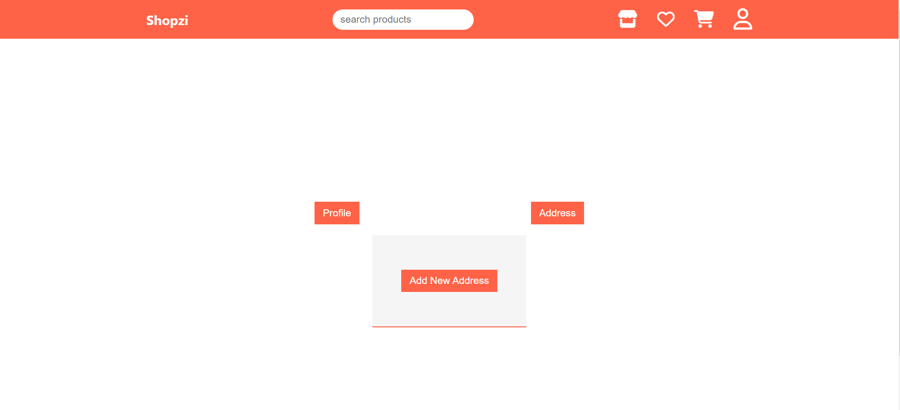

<p align="center" >

</p>

<div align="center" >
<h1 >⚛️ Shopzi ⚛️</h1>
</div>

## About

Welcome to Shopzi - Your Ultimate E-commerce Destination!

Shopzi is an e-commerce app to buy products online , where you can find a wide range of products. Discover an extensive range of items, from electronics to fashion,. Discover the latest trends, snag the best deals. Happy shopping!

## 🚀 Live Link

- [Shopzi](https://shopzi.netlify.app/)

## Screens in this project

- Login, Signup Pages
- Home Page
- Product Listing Page
- Product Details Page
- Cart Management Page
- WishList Management Page
- Checkout Page
- order Summary Page
- Payment gateway integration
- 404 (Not Found) Page

## Features

### Home Page

- Our homepage showcase various product categories ,You can explore different categories by clicking on them. Clicking on any category will take you to a page dedicated to products in that specific category.

### Product Listing Page

- User can see all the available products are listed there.
- User can Sort them according to price.
- User can Filter product by category, price range, rating , and other filters.
- Clear button to Clear All filters.
- User can Add wishlist , remove from wishlist
- User can Add to cart.
- Search functionality is also implemented user can find products by title.

### Product Detail Page

- User can see detailed information about a specific product such as the title, the price, rating, review , discount and some other details.

- User can also add products to the cart and wishlist from the product detail page as well .

### Cart Management Page

- User can see all the added to cart products present there.
- User can also increase or decrease the product quantity, and remove items from the cart.
- User can also move cart product to wishlist.
- User can see the total price of the products in the cart.

### Wishlist Management Page

- User can see all wishlisted products listed there.
- User can remove wishlisted products from wishlist page.
- User can also move wishlist product to cart.

### Address Management

- User can add new addresss for orders.
- User can Edit or remove existing addresses.

### Checkout Page

- User can see total price and delivery addresses there.
- User can place their order on click of place order button

### Order Summary Page

- After payment success it will redirect to Order Summary Page where User can see payment details like paymentId, price ,delivery addresss and also products that bought.

### Login

- User can able to login by entering email and password
- User can use guest credentials to login
- Logged in user only can access the protected page of this app.

### SignUp

- New User can create account to access all the protected routes of the app

### Private Routes

- All the user specific routes such as cart , wishlist , checkout and order summary page are made as private routes and can be accessed only after login

### Loaders and Toasts

- User see loading spinners when data (products) is loading.
- User can see acknowledgement alerts for various actions such as adding items to the cart or wishlist, removing items from the wishlist, etc.

## Technologies Used

- Frontend : React Js , React Context API + useReducer , useState , React Router , Vanilla CSS

- Backend : [Mockbee](https://mockbee.netlify.app/)
- Authentication : JWT

## Getting Started

1. Clone the repository.
   `https://github.com/manishgupta416/Shopzi.git`
2. cd .\shopzi\
3. Install dependencies using `npm install`.

4. Create a **.env** file at the root level of the directory (at the level of `package.json` file) and add this as environment variable

```sh
REACT_APP_JWT_SECRET = <JWT_SECRET_KEY_OF_YOUR_CHOICE>
```

5. Start the development server with `npm start`.

## Usage

1. Sign up or log in to access all the app's features.
2. Explore the products.

## 📸 ScreenShots





## Contributing

Contributions are welcome! To contribute to the project, follow these steps:

1. Fork the repository.
2. Create a new branch for your feature or bug fix.
3. Make your changes and commit them.
4. Push your changes to your forked repository.
5. Submit a pull request to the main repository.

## Contact

For any questions or feedback, please contact [Your Name]`(https://github.com/manishgupta416/).`

<h3 align="center">Connect with me 🤝 </h3>
<div align="center">

[](https://www.linkedin.com/in/imanishgupta1/)
[](https://twitter.com/manish_gupta416)

[](mailto:manish.info2020@gmail.com)
[](https://www.instagram.com/manish_gupta416/)

</div>
